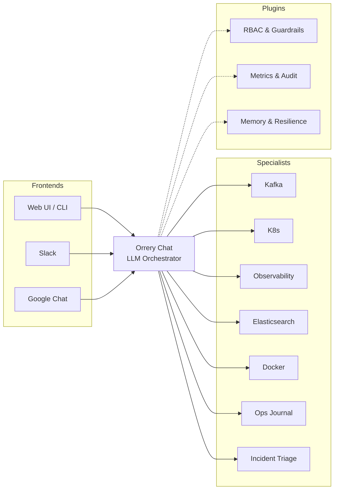

# 🤖 Orrery — AI Agents for DevOps & SRE

[](https://github.com/BAHALLA/orrery/actions/workflows/ci.yml)
[](https://bahalla.github.io/orrery/)
[](https://github.com/BAHALLA/orrery/blob/main/LICENSE)
[](https://www.python.org/downloads/release/python-3140/)
[](https://docs.astral.sh/uv/)

**Orrery** is an open-source platform for building **autonomous DevOps and SRE agents**. Built with [Google ADK](https://google.github.io/adk-docs/) and managed as a [uv workspace](https://docs.astral.sh/uv/concepts/workspaces/).

---

### 🚀 [Read the full documentation at bahalla.github.io/orrery](https://bahalla.github.io/orrery/)

---

## 💡 Why Orrery?

DevOps and SRE teams often face a "wall of alerts" and repetitive manual triage. **Orrery** (named after the mechanical models of the solar system) provides **specialist agents** that don't just alert you — they **investigate, correlate, and remediate**.

- **Don't just see a lag spike:** The Kafka agent checks consumer groups, the K8s agent inspects the pods, and the Observability agent queries Prometheus — all in parallel.
- **Don't just restart blindly:** Self-healing loops verify if an action worked and retry with a different strategy if it didn't.
- **Stay in control:** Destructive operations always require human approval via a secure confirmation flow.

## 🏗️ Architecture at a Glance



## ✨ Key Features

### 🧩 Intelligence & Orchestration
- **Multi-agent coordination** — A root orchestrator delegates to specialists (Kafka, K8s, etc.) via dynamic routing or deterministic pipelines.
- **Opt-in planning** — Set `ORRERY_PLANNER=plan_react` (provider-agnostic) or `builtin` (Gemini thinking tokens) to attach an ADK planner to the root orchestrator, triage summarizer, and remediation actor — explicit reasoning before destructive ops.
- **Self-healing (graph workflow)** — Closed-loop remediation as a bounded graph cycle: **Act** (restart/scale) → **Verify** → **Retry** (up to 3 times), capped by `verify_route`.
- **Cross-session memory** — Agents recall past incidents, investigations, and team preferences across sessions.
- **Long incidents don't hit the context wall** — Past a token threshold, older turns are compacted into a digest while recent ones stay verbatim. Lossy for the model, **lossless for the record**: the original events remain in the session and are filtered only when the request is assembled, so audit and replay are untouched.

### 🛡️ Safety & Governance
- **Human-in-the-Loop** — Mutating (`@confirm`) and destructive (`@destructive`) tools require explicit human confirmation. On every shipped surface that approval is **requester-verified**: a deliberate word, from the same verified person who triggered the action, spoken after the action existed — a casual "ok" or someone else's "approve" won't do.
- **RBAC Hierarchy** — Three-role system (**Viewer**, **Operator**, **Admin**) enforced globally via plugins, with an orthogonal **autonomy level** (L2 read-only / L3 mutating / L4 confirmed-destructive) that answers *which mode this process runs in* rather than *who is asking*.
- **Prompt-injection screening in both directions** — An injected user message is blocked before the model runs. Text that arrives *inside a tool result* — a pod annotation, a log line, a topic name — is neutralized in place instead, because that payload is also the evidence being diagnosed. Credentials are scrubbed from tool results and from long-term memory by one shared pattern set.
- **SSO / OIDC sign-in** — The web console signs in with **Authorization Code + PKCE** against any OIDC provider (Keycloak, Authentik, Auth0, Okta, Entra ID, Google); the front door verifies the resulting tokens via RS256/JWKS and maps claims → roles. A local Keycloak with viewer/operator/admin demo users ships behind `make up PROFILES=sso`. Without an issuer configured it falls back to a pasted bearer token, so CI and offline work need no IdP.
- **JWT authentication** — The HTTP front door (`orrery_core.serving.server`) verifies HS256 or RS256/JWKS bearer tokens, maps claims → roles (including nested paths like `realm_access.roles`), and rejects unauthenticated traffic. See [`docs/config/security.md`](https://bahalla.github.io/orrery/config/security/).
- **Audit Trails** — Every tool call is logged with structured JSON, including user ID and session context.
- **Secrets via mounted files** — `SecretsManager` reads from `ORRERY_SECRETS_DIR` (Kubernetes Secret volume) before falling back to env vars.

### 🔌 Integration & Observability
- **Multi-Interface** — Interact via the **Web Console**, **ADK Web UI**, **CLI**, **Slack**, or **Google Chat** (Cards v2, with thread-reply confirmations by default and opt-in interactive buttons on HTTP deployments).
- **Web Console** — Opt-in React SPA (`ORRERY_WEB_CONSOLE_ENABLED=true`) served by the FastAPI front door: SSO or token-gated chat, a tool-call timeline, the approve/deny panel for guarded actions, a triage view, and a first-run **environment check** that tells you which integrations are actually wired and what to configure when one isn't. See [`docs/integrations/web-console.md`](https://bahalla.github.io/orrery/integrations/web-console/).
- **Observability** — Built-in Prometheus metrics for tool latency, error rates, and circuit breaker states.
- **Context Caching** — Optimized for Gemini models to reduce token usage and latency.

## 🚀 Quick Start (Docker)

The fastest way to try Orrery is to pull the pre-built image from GHCR — no
clone required.

### Prerequisites
- [Docker](https://docs.docker.com/get-docker/)
- An LLM API key (Gemini, Claude, or OpenAI) — or a local [Ollama](https://ollama.com/) model, no key required

### Kick the tires (single container, ~30 seconds)
```bash
docker pull ghcr.io/bahalla/orrery:latest

docker run --rm -p 8000:8000 \
  -e GOOGLE_API_KEY=your-key \
  ghcr.io/bahalla/orrery:latest

# Open the web UI
open http://localhost:8000
```
The web UI boots with in-memory session state and whichever LLM provider you
configured. Tools that need Kafka, Postgres, or Prometheus (the full stack) are
covered below.

### Full stack (Kafka + Postgres + Prometheus + Loki + Alertmanager)
```bash
# 1. Grab the compose file (still no clone required)
curl -O https://raw.githubusercontent.com/BAHALLA/orrery/main/docker-compose.yml

# 2. Start the full stack — uses the pulled image by default
GOOGLE_API_KEY=your-key docker compose --profile demo up -d

# 3. Open the web UI
open http://localhost:8000
```

### From source

```bash
make install   # Python workspace + web console
make up        # All containers (Kafka, Postgres + pgAdmin, observability, Keycloak, Elasticsearch)
make run-api   # API + web console on http://localhost:8000
make dev-token # Mint a token to sign in with (ROLE=viewer|operator|admin)
```

Variants are flags, not separate targets — `make run-api SSO=1`, `make run-cli PERSIST=1`,
`make run-slack MODE=socket`, `make up PROFILES=tracing`. `make help` lists everything,
and `make check` runs the whole gate (lint, types, Python tests, web tests).

*For more setup options (Claude, OpenAI, local models), see the [Configuration Guide](https://bahalla.github.io/orrery/config/general/).*

## 🤖 Available Agents

| Agent | Expertise |
|-------|-----------|
| [**orrery-assistant**](https://bahalla.github.io/orrery/agents/orrery-assistant/) | Root orchestrator, incident triage, and remediation. |
| [**k8s-health**](https://bahalla.github.io/orrery/agents/k8s-health/) | Nodes, Pods, Deployments, Logs, Events, and Rollbacks. |
| [**kafka-health**](https://bahalla.github.io/orrery/agents/kafka-health/) | Brokers, Topics, Consumer Groups, and Lag monitoring. |
| [**observability**](https://bahalla.github.io/orrery/agents/observability/) | Prometheus metrics, Loki logs, and Alertmanager silences. |
| [**elasticsearch**](https://bahalla.github.io/orrery/agents/elasticsearch/) | Cluster health, indices, shard allocation, search, ILM, snapshots, and ECK CRs. |
| [**docker-agent**](https://bahalla.github.io/orrery/agents/docker-agent/) | Container health, stats, logs, and Compose projects. |
| [**slack-bot**](https://bahalla.github.io/orrery/agents/slack-bot/) | Interactive Slack integration with confirmation buttons. |
| [**google-chat-bot**](https://bahalla.github.io/orrery/agents/google-chat-bot/) | Google Chat integration with interactive Cards v2. |
| [**ops-journal**](https://bahalla.github.io/orrery/agents/ops-journal/) | Persistent notes and session-level bookmarks. |
| **remediation-nodes** | Closed-loop actor and verifier nodes wired via graph routing. |

## 📚 Documentation

- 🏁 **[Getting Started](https://bahalla.github.io/orrery/getting-started/)** — Step-by-step setup and first interaction.
- ⚙️ **[Configuration](https://bahalla.github.io/orrery/config/general/)** — LLM providers, env vars, and infrastructure.
- 🛠️ **[Developer Guide](https://bahalla.github.io/orrery/adding-an-agent/)** — How to build and test your own specialist agents.
- 🏗️ **[Architecture](https://bahalla.github.io/orrery/agent-design-patterns/)** — Design patterns, RBAC, and ADRs.

## ⚖️ License

This project is licensed under the [MIT License](LICENSE).
