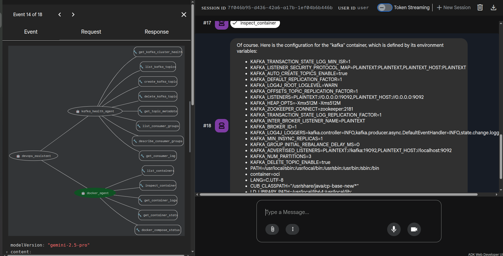

# orrery-assistant

A multi-agent orchestrator that routes user requests to specialist agents. The
root is a **conversational chat-mode `LlmAgent`** (`orrery_chat_agent`) that holds
real conversation history and delegates to specialists via `AgentTool`. A separate
**graph `Workflow`** (`orrery_triage_workflow`) provides a deterministic, parallel,
bounded-loop incident-response pipeline for batch / scheduled runs.

This inverts the original design (LLM-routing root + deterministic `SequentialAgent`
sub-pipeline). See [ADR-003](../../docs/adr/003-graph-workflow-inversion.md), which
supersedes [ADR-002](../../docs/adr/002-agent-tool-vs-sub-agents.md): the deprecated
`SequentialAgent` / `ParallelAgent` / `LoopAgent` wrappers were replaced by a native
ADK 2.0 graph.

## Architecture

```text
orrery_chat_agent (chat-mode LlmAgent, ROOT — interactive: web / CLI / Slack / Chat)
├── [AgentTool] kafka_health_agent       — Kafka cluster health, topics, lag
├── [AgentTool] k8s_health_agent         — K8s nodes, pods, deploys, scale/restart/rollback
├── [AgentTool] observability_agent      — Prometheus/Loki/Alertmanager
├── [AgentTool] elasticsearch_agent      — ES health, indices, shards, ILM, ECK CRs
├── [AgentTool] docker_agent             — Containers, stats, logs, compose
├── [AgentTool] ops_journal_agent        — Notes, preferences, session tracking
├── [AgentTool] incident_triage_agent    — Single-turn full health sweep across ALL systems
└── PreloadMemoryTool                    — Cross-session memory recall

orrery_triage_workflow (graph Workflow, ROOT — batch: `make run-triage`)
  START ─▶ [parallel] kafka / k8s / docker / observability / elasticsearch checkers
        ─▶ health_join (JoinNode, waits for all 5)
        ─▶ triage_summarizer (record_triage_verdict → incident_severity)
        ─▶ journal_writer ─▶ triage_route
              ├─("remediate")▶ remediation_actor ⇄ remediation_verifier
              │                    └▶ verify_route ─("retry")▶ actor
              │                                    └("done")▶ remediation_summarizer ─▶ final_report
              └─("resolved")────────────────────────────────────────────────────────▶ final_report
```

A `Workflow` is not a `BaseAgent`, so it cannot be a sub-agent or `AgentTool` of the
chat coordinator, and a chat-mode agent cannot be a routed node inside a graph — hence
the two roots are separate entrypoints that reuse the same node agents. For
interactive "run a triage" requests, the coordinator delegates to the single-turn
`incident_triage_agent` `AgentTool` instead.



## Specialist Agents (AgentTool)

Each specialist is the standalone agent reused as an `AgentTool`:

| AgentTool | Source | Handles |
|-----------|--------|---------|
| `kafka_health_agent` | [kafka-health](../kafka-health/) | Cluster health, topics, consumer groups, lag, Strimzi CRs |
| `k8s_health_agent` | [k8s-health](../k8s-health/) | Nodes, pods, deployments, logs, events, scale/restart/rollback (guarded) |
| `observability_agent` | [observability](../observability/) | Prometheus metrics/alerts, Loki logs, Alertmanager |
| `elasticsearch_agent` | [elasticsearch](../elasticsearch/) | Cluster/index/shard health, ILM, snapshots, ECK CRs |
| `docker_agent` | [docker-agent](../docker-agent/) | Containers, stats, logs, compose status |
| `ops_journal_agent` | [ops-journal](../ops-journal/) | Notes, preferences, session tracking, bookmarks |

After a significant investigation, the coordinator proactively suggests saving
findings via `ops_journal_agent`, and relevant context from past sessions is loaded
automatically via `PreloadMemoryTool`.

## How Delegation Works

### Conversational routing (interactive root)

`orrery_chat_agent` is the LLM coordinator. It keeps conversation history (`mode="chat"`)
and picks the right `AgentTool` based on intent:

- *"what's the consumer lag?"* → `kafka_health_agent`
- *"list all pods in staging"* → `k8s_health_agent`
- *"is the cluster green?"* → `elasticsearch_agent`
- *"is everything healthy?"* / *"run a triage"* → `incident_triage_agent` (full sweep)
- *"save a note about this incident"* → `ops_journal_agent`

### Deterministic triage Workflow (batch root)

`orrery_triage_workflow` is the graph-native pipeline for scheduled / batch runs:

1. **Parallel**: five health checkers (Kafka, K8s, Docker, Observability, Elasticsearch)
   run concurrently, each writing its status to session state via `output_key`.
2. **Join + summarize**: `health_join` waits for all five, then `triage_summarizer`
   synthesizes a report and calls `record_triage_verdict` (sets `incident_severity`).
3. **Journal**: `journal_writer` saves the report as a note tagged `incident-triage`.
4. **Route**: `triage_route` reads the verdict — degraded/critical → remediation,
   healthy → finish. If the LLM emitted no structured verdict it infers severity from
   the per-system reports and flags `triage_verdict_missing` (fail-safe — never
   silently "resolved").
5. **Closed-loop remediation**: `remediation_actor → remediation_verifier → verify_route`
   retries act→verify up to `MAX_REMEDIATION_ITERATIONS` (3), bounded by a state
   counter. The verifier calls `mark_remediation_resolved` to stop early.

## Running

```bash
cd agents/orrery-assistant
uv run adk web                    # ADK Dev UI (interactive chat root)
uv run adk run orrery_assistant   # Terminal mode
```

Or from the repo root:

```bash
make run-assistant              # ADK Dev UI (in-memory state)
make run-assistant-cli          # Terminal mode (in-memory state)
make run-assistant-persistent   # Terminal with persistence (in-memory, or PostgreSQL via DATABASE_URL)
make run-assistant-api          # FastAPI front door with JWT auth (dev secret)
make run-triage                 # Run the deterministic triage Workflow once (batch)
```

`make run-devops*` are aliases for the `run-assistant*` targets.

### Persistent Mode

By default (`adk web`), state resets on restart. Use persistent mode to keep `user:*`
and `app:*` state across sessions:

```bash
make run-assistant-persistent
```

Without `DATABASE_URL` this runs in-memory; set a PostgreSQL `DATABASE_URL` and
`DatabaseSessionService` keeps notes and preferences across restarts. Type `new`
to start a fresh session while keeping long-term state.
