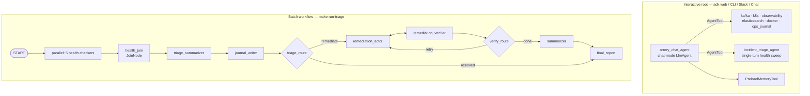

# ADR-003: Graph-Based Workflow and Conversational Root

**Status:** Accepted
**Date:** 2026-06-07
**Author:** Taoufiq
**Supersedes:** [ADR-002](002-agent-tool-vs-sub-agents.md)

## Context

ADK 2.0 introduced the **Workflow Runtime** — a graph-based execution engine where
agents, functions, and tools are nodes connected by edges. The legacy workflow agents
(`SequentialAgent`, `ParallelAgent`, `LoopAgent`) are **deprecated** in 2.0 ("Please
use Workflow instead") and emit `DeprecationWarning` on construction.

The previous root (ADR-002) was an **LLM orchestrator** (`orrery_assistant`, an
`LlmAgent`) that:
- exposed six specialist agents as `AgentTool`s and let the LLM route by intent, and
- kept a deterministic `incident_triage_agent` (`SequentialAgent`) as a sub-agent.

The `Workflow` class provides deterministic routing and parallel execution without deprecation warnings. However, ADK 2.0 enforces a strict constraint: a conversational `LlmAgent` (multi-turn, `mode='task'|'chat'`) cannot be embedded as a routed static node inside a `Workflow` graph, because the graph scheduler overwrites `node_input` on resume, destroying conversational context.

**Decision driver:** We need *both* a conversational orchestrator for free-form user interaction *and* a deterministic, auditable incident-response pipeline (triage → remediate → report) built on the new `Workflow` graph.

## Validated API facts (ADK 2.2.0)

- `LlmAgent` **is** a `BaseNode`, so existing `create_agent()` results are valid nodes.
- A `Workflow` cannot be passed to `AgentTool` or used as a `sub_agent` inside an `LlmAgent` because it does not subclass `BaseAgent`.
- Conversational agents (`LlmAgent` with `mode='chat'|'task'`) lose their memory/context when placed as static nodes inside a `Workflow` because the graph runner overwrites their inputs upon resuming.
- Edge forms: sequential chain `("START", a, b, c)`; parallel fan-out
  `("START", (a, b, c))`; conditional/loop via `RoutingMap` `(node, {"k": x, ...})`.
- `JoinNode` (`_requires_all_predecessors = True`) is the fan-in **barrier**: it waits
  for all parallel predecessors before firing the successor.

## Decision

We maintain two separate entry points that reuse the same underlying node agents:

1. **The Interactive Root (`orrery_chat_agent`)**: An `LlmAgent` acting as the conversational orchestrator. It uses `AgentTool`s to route requests to specialists, and exposes a single-turn `incident_triage_agent` for broad health sweeps.
2. **The Deterministic Graph (`orrery_triage_workflow`)**: A standalone ADK 2.0 `Workflow` graph used for batch or scheduled incident responses (via `make run-triage`).

### Mapping from the deprecated agents

| Old construct | New construct |
|---|---|
| `health_check_agent` (`ParallelAgent`) | fan-out tuple `("START", (…5 checkers…))` + `health_join` (`JoinNode`) |
| `incident_triage_agent` (`SequentialAgent`) | chain `health_join → triage_summarizer → journal_writer` |
| `remediation_loop` (`LoopAgent`, max=3) | `actor → verifier → verify_route` with `RoutingMap {"retry": actor, "done": summarizer}`, bounded by `remediation_iteration` counter in state |
| `remediation_pipeline` (`SequentialAgent`) | the remediation subgraph above |
| `exit_loop` tool (`actions.escalate`) | `mark_remediation_resolved` tool + `verify_route` reading state |
| Root `LlmAgent` + 6 `AgentTool`s | **preserved** as `orrery_chat_agent` — the interactive root. |

### Routing decisions are deterministic FunctionNodes

In the `orrery_triage_workflow`, `triage_summarizer` emits a structured `incident_severity` (`healthy | degraded | critical`) into state alongside its prose `triage_report`. `triage_route` and
`verify_route` are pure Python `FunctionNode`s — unit-testable without an LLM. The
`MAX_REMEDIATION_ITERATIONS = 3` cap is enforced by a state counter, replacing
`LoopAgent.max_iterations`.

## Consequences

### Positive
- **Conversational routing preserved natively** — `orrery_chat_agent` retains full chat memory and free-form LLM delegation.
- **No deprecation warnings** — the deprecated workflow agents are gone from the codebase.
- **Deterministic & auditable automation** — the triage/remediation path is a fixed graph (`orrery_triage_workflow`); routing logic lives in testable functions, not LLM discretion.
- **Same building blocks** — health-checkers, summarizer, actor, verifier, and specialist `LlmAgent`s are reused across both the interactive root and the batch workflow.
- **Plugins/RBAC/metrics unchanged** — they attach at the `App`/`Runner` level. The Slack and Google Chat confirmation walkers traverse `graph.nodes` so guarded destructive tools still fire interactive approvals when the graph is run.

### Negative / breaking
- **Split Entry Points** — Conversational interactions and full deterministic DAG executions now start from different orchestrators.
- **`planner_routing` eval removed** — it asserted LLM→AgentTool routing against the old root module.
- **ADR-002 superseded** — the AgentTool-vs-sub-agent decision no longer solely governs the system shape (kept for historical context).

### Neutral
- Specialist agents still build with planners; planner wiring is unaffected.
- `runner.py` / `server.py` accept an `Agent | Workflow` root, allowing integration tests against either.

## Implementation

- `agents/orrery-assistant/orrery_assistant/agent.py` — define node agents, `orrery_chat_agent` (conversational LLM + AgentTools + memory), and `orrery_triage_workflow` (`Workflow`); export `orrery_chat_agent` as `root_agent`.
- `agents/orrery-assistant/run_triage.py` — standalone script to execute the deterministic triage graph.
- `agents/orrery-assistant/orrery_assistant/remediation.py` — expose actor/verifier/summarizer nodes + `verify_route` + `mark_remediation_resolved`; drop `LoopAgent`/`SequentialAgent`.
- `agents/{slack-bot,google-chat-bot}` — confirmation walkers traverse `graph.nodes` (for integration with workflow executions).
- `core/orrery_core` — removed the deprecated `create_sequential/parallel/loop_agent` factories; `run_persistent`/`create_app` accept `Agent | Workflow`.
- Tests: `test_graph_flow.py` (end-to-end execution of routing nodes), `test_planner_wiring.py` (graph vs conversational root structure).
