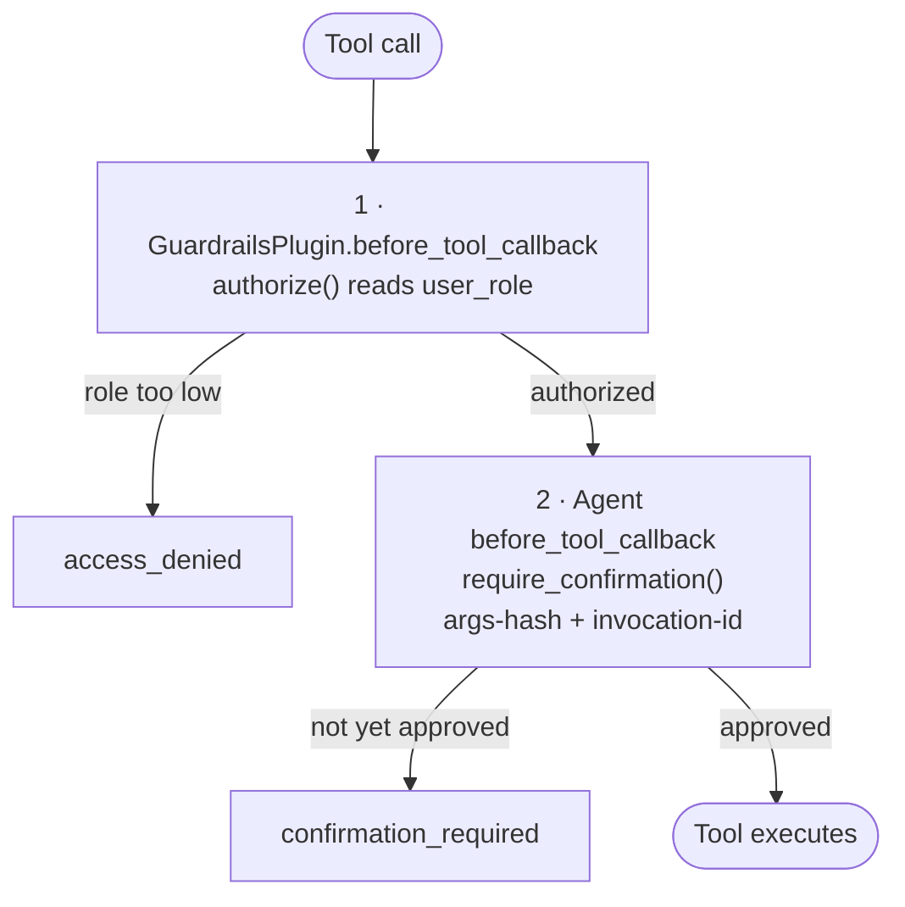

# Guardrails

Every tool on the platform falls into one of three risk tiers, set by decorators on the tool function. The `GuardrailsPlugin` reads that metadata at runtime to enforce **RBAC** (who can call it) and `require_confirmation()` enforces **human-in-the-loop confirmation** (did they confirm this exact call).

Related pages:
- [ADR-001: RBAC](adr/001-rbac.md) — design rationale for the three-role hierarchy.
- [Testing RBAC across surfaces](rbac-testing.md) — how to exercise each tier from ADK Web, Slack, Google Chat, the JWT front door, and the CLI.
- [Security & auth](config/security.md) — JWT bearer-token verification, claim-to-role mapping, and the secrets manager. RBAC is only as trustworthy as the identity that set the role.
- [Core Library → RBAC](core/README.md#role-based-access-control-rbac) — `authorize`, `RolePolicy`, `@requires_role`, `set_user_role` reference.

## The three tiers

| Decorator | Risk | Minimum role | Example |
|-----------|------|--------------|---------|
| *(none)* | Read-only | `viewer` | `list_topics`, `get_nodes`, `query_prometheus` |
| `@confirm("reason")` | Mutating but reversible | `operator` | `create_kafka_topic`, `scale_deployment`, `restart_container` |
| `@destructive("reason")` | Irreversible | `admin` | `delete_kafka_topic`, `rollback_deployment`, `remove_image` |

The decorator just attaches metadata — it doesn't change tool behavior at import time. The plugin and callback machinery reads that metadata when the tool is invoked.

## Authoring a tool

```python
from orrery_core import confirm, destructive, with_retry
from orrery_core.security.validation import validate_string

@with_retry(max_retries=3)
async def list_topics() -> dict:
    """Read-only — no decorator needed."""
    ...

@confirm("Creates a topic in the cluster.")
async def create_topic(name: str, partitions: int) -> dict:
    """Mutating — operator+ can call, confirmation is required."""
    if err := validate_string(name, "name", max_len=100):
        return err
    ...

@destructive("Permanently deletes all data in the topic.")
async def delete_topic(name: str) -> dict:
    """Irreversible — admin only, confirmation is required."""
    ...
```

The `reason` string surfaces in the confirmation prompt and in the RBAC denial message, so write it in a way that helps the operator decide.

## How enforcement happens

Two independent callbacks fire before every tool call:



RBAC runs first by design. A viewer asking for `delete_kafka_topic` is denied before they ever see a confirmation prompt — there's no "will you confirm? oh wait, you can't do this anyway" round-trip.

See [ADR-001 § Plugin execution order](adr/001-rbac.md#plugin-execution-order) for the full sequence.

## Why confirmation is wired at the agent level (not the plugin)

`GuardrailsPlugin` in its default `"confirm"` mode only does RBAC — it does **not** attach a confirmation gate. Confirmation is wired per-agent:

```python
from orrery_core import create_agent, require_confirmation

root_agent = create_agent(
    name="my_agent",
    ...,
    before_tool_callback=require_confirmation(),
)
```

Rationale: confirmation needs to work identically whether the agent is called as a sub-agent via `AgentTool`, run standalone in `adk web`, or invoked from a custom integration. Attaching it at the agent level guarantees that regardless of how the tool is reached, the same gate fires once.

## Overriding the default role for a specific tool

### Via `RolePolicy`

```python
from orrery_core import RolePolicy, Role, default_plugins

policy = RolePolicy(overrides={
    "list_sensitive_topics": Role.OPERATOR,   # read-only, but gated
    "create_kafka_topic": Role.ADMIN,         # elevate from @confirm default
})
plugins = default_plugins(role_policy=policy)
```

### Via `@requires_role`

```python
from orrery_core import requires_role, Role

@requires_role(Role.ADMIN)
async def list_audit_log() -> dict:
    """Read-only, but only admins should see it."""
    ...
```

`@requires_role` takes precedence over the decorator-inferred role when both are present.

## Bypassing confirmation in specific contexts

### Slack and Google Chat bots

Both bots replace text-based confirmation with an interactive surface. The handlers set `guardrail_mode="none"` on `default_plugins()` to skip the plugin's confirmation gate, then wire a custom `before_tool_callback` that emits the platform-native UI instead:

Both bots run the same two-phase handshake over the **shared platform confirmation store** (`core/orrery_core/security/confirmation_store.py`, backend via `ORRERY_CONFIRMATION_BACKEND`): the callback registers a pending scoped by the conversation (thread/space for Chat, channel/thread for Slack), the decision handler verifies the decider **is the requester** (`orrery_core.approval_refusal` — fail-closed; deny is open to anyone) and marks the entry approved, and the LLM's retry consumes it by `(scope, tool_name, args_hash)` within a 120s validity window — one-shot, args-hash pinned. The store (not session state) is load-bearing: many guarded tools live on `AgentTool`-wrapped specialist agents whose ADK sub-sessions are ephemeral and don't propagate state writes back to the parent session, so an in-state retry flag would be lost. What differs per transport is only the surface:

- **Slack** (`agents/slack-bot/slack_bot/confirmation.py`) — Block Kit Approve/Deny buttons; the refusal message renders the requester as an `<@id>` mention.
- **Google Chat** (`agents/google-chat-bot/google_chat_bot/confirmation.py`) — Card v2 whose decision channel is transport-dependent: reply **approve**/**deny** in the card's thread (default; the only channel that works over Pub/Sub, where button clicks can't complete their synchronous round-trip), or inline Approve/Deny buttons on HTTP deployments (`GOOGLE_CHAT_INTERACTIVE_BUTTONS=true`). Both channels carry the decider's verified email.

Sub-agents keep their per-agent `require_confirmation()` as a fallback for guarded tools reached without going through the root. `apply_chat_confirmation()` walks the agent tree and overrides every LlmAgent's `before_tool_callback` so guarded tools on sub-agents post a Card v2 too instead of falling back to the text prompt.

### Dry-run mode

```python
plugins = default_plugins(guardrail_mode="dry_run")
```

Every guarded tool returns a `{"status": "dry_run", "would_execute": ...}` payload without actually running. Useful for demos, CI, or when operators want to preview a plan before enabling real writes.

## What confirmation actually checks

`require_confirmation()` builds a key from `(tool_name, args-hash, invocation-id)` and stores it in session state. The tool runs only when the LLM's follow-up call matches the same key with a confirmation flag set.

Consequences:
- **Arg drift breaks the cache.** If the LLM retries `delete_topic(name="logs")` with `name="logs-v2"`, that's a fresh confirmation.
- **Invocation scope.** The same "yes" cannot silently authorize a different destructive call later in the turn.
- **No state leakage.** Confirmation lives in session state, so restarts invalidate pending approvals.

In **requester-verified (strict) mode** — armed by `AgentGateway(verified_confirmation=True)`, i.e. every shipped exposition — the pending moves out of session state into the shared platform store (`core/orrery_core/security/confirmation_store.py`, the same one the Slack and Google Chat bots use), scoped by the requester. This is load-bearing: guarded tools are routinely reached through an `AgentTool` whose sub-session is throwaway, so the requester is the only identity visible on both sides of that boundary, and keying by requester is also what enforces "only the person who triggered the action may approve it". The human `approve`/`deny` recorded by the gateway consumes the pending **atomically** (a single check-and-remove), so one decision can never authorize two executions.

A decision is only ever valid for the action it was spoken about, enforced from both ends:

- The gateway **rewrites** the decision key on every turn, writing `None` when the message isn't a decision. Without that, an `approve` typed while nothing was pending would sit in session state for the full TTL.
- The gate requires `decision.timestamp >= pending.created_at`. A decision that predates the pending cannot have been informed by it — the human never saw that action — so it is refused and the action is re-prompted. This closes the case where the model raises a pending and immediately re-calls the tool in the same turn: the args-hash would match, but the approval would be one the operator gave for something else.

The store has two backends, selected by `ORRERY_CONFIRMATION_BACKEND`:

- `memory` (default) — process-local. Correct only for a **single replica**: a pending raised on pod A is invisible to the pod that receives the approval, and it dies with the pod on restart.
- `postgres` — shares the handshake across replicas over the platform's existing `DATABASE_URL` (one `orrery_confirmations` table, created on startup; no new infrastructure) and survives restarts. The atomic consume is a single `DELETE … RETURNING`, so two replicas racing on the same approval cannot both win. **Required whenever any transport (HTTP front door, persistent runner, Slack bot, Chat Pub/Sub worker) runs more than one replica.** The gateway resolves the backend at startup and fails fast if `postgres` is selected without a usable `DATABASE_URL` — same contract as the session store.

## Related config

| Variable | Default | Purpose |
|----------|---------|---------|
| `guardrail_mode` (arg to `default_plugins`) | `"confirm"` | `"dry_run"` preview mode, `"none"` for integrations with their own UX |
| `ORRERY_CONFIRMATION_BACKEND` | `memory` | Strict-mode pending store: `postgres` shares approvals across replicas via `DATABASE_URL` (required for multi-replica HTTP) |
| `role_policy` (arg to `default_plugins`) | `None` | Per-tool role overrides via `RolePolicy` |
| `ORRERY_PROTECTED_NAMESPACES` | *(unset — inert)* | Comma-separated globs naming namespaces where only `admin` may mutate. Reads are never scoped. See [ADR-001](adr/001-rbac.md#namespace-scope-restricting-where-not-just-what) |
