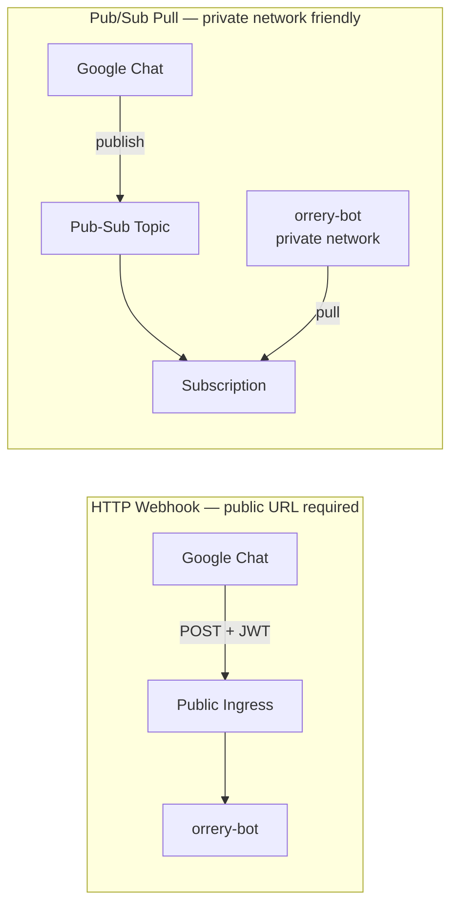
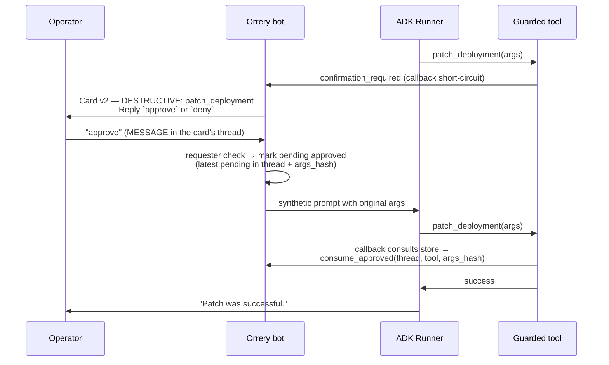

# Google Chat Bot Integration

{ align=right width="400" }

The Orrery platform ships a Google Chat integration that supports **thread-based session isolation**, **email-based RBAC**, and **human Approve/Deny flows for guarded tools** for guarded tools.

Google Chat supports two ways of connecting to your bot. Choose the one that best fits your infrastructure:



<div class="grid cards" markdown>

-   :material-webhook:{ .lg .middle } __[HTTP Webhook Setup](google-chat-webhook.md)__

    ---

    Standard connection for bots with a public URL (Ingress, Cloud Run, ngrok). Lowest latency.

-   :material-swap-horizontal:{ .lg .middle } __[Pub/Sub Setup](google-chat-pubsub.md)__

    ---

    Ideal for private networks (GKE). Bot pulls events from a queue; no public ingress required.

</div>

---

## Shared Concepts

Regardless of the transport you choose, the following concepts apply to all Google Chat deployments.

### Async Response Mode

Google Chat enforces a **~30 second synchronous budget** on webhook responses. If an agent run exceeds this budget, the UI will show an error. Orrery solves this with **Async Response Mode**:

1.  **Immediate Ack**: The bot returns a `200 OK` (empty `hostAppDataAction`) immediately.
2.  **Progress card posted**: A live "🔍 Investigating…" Card v2 is posted to the thread via the Chat REST API.
3.  **Background run**: The agent run proceeds. As sub-agents report in, the bot **PATCHes the same card in place** (`spaces.messages.patch` with `updateMask=cardsV2`) — no thread spam.
4.  **Final result**: On completion, the progress card is replaced with the final reply (see *Progressive Cards* below).

This mode is enabled by default (`GOOGLE_CHAT_ASYNC_RESPONSE=true`).

### Progressive Cards

For long-running investigations (incident triage, remediation loops), the bot streams progress live by updating a single message in place. The user sees the run evolve instead of staring at a blank thread for 60–120s.

**What the progress card shows:**

-   **Current step** — the friendly label for the executing sub-agent (e.g. `Checking Kafka`, `Synthesizing findings`).
-   **Tool breadcrumb** — the most recent tool call (`list_consumer_groups`, `get_pods`, …) so operators can see what the agent is doing right now.
-   **Subsystem chips** — one row per health-check subsystem that has reported in, with a severity icon inferred from the status text:
    -   ✅ `ok` · ⚠️ `warn` (yellow/degraded/lag) · ❌ `fail` (red/critical/crashloop) · ⏳ `pending`
-   **Remediation panel** (when the remediation subgraph is running) — shows `remediation_action` → `verification_result` → `remediation_summary` as the act → verify → retry loop iterates.
-   **Elapsed seconds** — visible forward-progress signal.

Card updates are **debounced at 800ms** and **force-flushed** on each subsystem status write to balance liveness against Chat's update quota.

**Final result card (triage runs):**

When the run writes `kafka_status` / `k8s_status` / `docker_status` / `observability_status` / `elasticsearch_status` / `triage_report` into session state (i.e. the triage pipeline ran), the progress card is replaced with a structured **Triage Report** card:

-   **Header** — overall severity badge: 🟢 *All systems healthy* / 🟡 *Degraded* / 🔴 *Critical*.
-   **Subsystem sections** — one section per subsystem with an icon and short summary.
-   **Summary** — the `triage_summarizer` output.
-   **Remediation shortcut** — when overall severity is `warn` or `fail` **and** the viewer is an `operator` or `admin`, the card offers remediation: a 🔧 button (`CARD_CLICKED` → `run_remediation`) when `GOOGLE_CHAT_INTERACTIVE_BUTTONS=true`, else an invitation to reply **remediate** in the thread (Pub/Sub-safe). Either fires the remediation flow in the same session, reusing the triage report already in state. RBAC is still enforced server-side at tool time — this is just a UI shortcut.

For non-triage queries (e.g. *"what's the Kafka lag?"*), no subsystem chips land, so the progress card falls back to a plain text/markdown final reply and the remediation hint is not shown.

**Failure modes handled:**

-   If `update_message` hits 404/410 (message deleted), subsequent updates are skipped silently.
-   If a later update fails for another reason, the final reply falls back to a fresh `create_message` so the user still gets a result.
-   If the agent run raises, the progress card is overwritten with an error card — never left stuck on "Investigating…".

### Authentication for Async Replies

Posting async replies requires a credential bearing the `https://www.googleapis.com/auth/chat.bot` scope.

-   **Local Dev**: You **must** use a Service Account JSON key. `gcloud auth login` cannot obtain this scope.
-   **Production (GKE)**: Use **Workload Identity**. Leave `GOOGLE_CHAT_SERVICE_ACCOUNT_FILE` unset and the bot will use ADC.

```bash
# Required for local dev
GOOGLE_CHAT_SERVICE_ACCOUNT_FILE=/path/to/key.json
```

### Role-Based Access Control (RBAC)

Identity is resolved from the user's verified email address.

| Role | Access | How to grant |
|------|--------|--------------|
| `viewer` | Read-only tools | Default |
| `operator` | Read + `@confirm` tools | Add email to `GOOGLE_CHAT_OPERATOR_EMAILS` |
| `admin` | All tools | Add email to `GOOGLE_CHAT_ADMIN_EMAILS` |

### Interactive Guardrails

When an agent attempts a tool marked `@confirm` or `@destructive`, the bot posts a **Card v2** describing the action (level, reason, arguments). The agent run is paused until a human decides. How the decision travels depends on the transport (`GOOGLE_CHAT_INTERACTIVE_BUTTONS`, default `false`):

- **Reply-in-thread (default — the only mode that works over Pub/Sub).** The card asks the operator to **reply `approve` or `deny` in the card's thread**. A reply is a plain `MESSAGE` event, which the Pub/Sub connection always delivers with the thread attached; the handler matches it against the thread's pending confirmation. Approve requires a deliberate word (`approve`, `confirm`, `proceed`, `go ahead` — a casual "ok"/"yes" is treated as normal conversation, not authorization); deny is broad (`no`, `cancel`, `stop`, `abort`, …).
- **Inline buttons (`true` — HTTP endpoint deployments only).** Real ✅ Approve / ❌ Deny buttons whose `CARD_CLICKED` event carries the exact `action_id`.



**Approval is requester-only and fail-closed**: the decision (reply or click) carries the sender's verified email, and only the user who triggered the guarded action may approve it — anyone else's approval is refused in-thread and the pending survives. Deny is open to anyone (an accidental deny is harmless; anyone should be able to stop a destructive action).

**Why buttons can't work over Pub/Sub.** A button click is resolved by Google's Workspace add-ons runtime with a **synchronous HTTPS round-trip**: Chat invokes the app's deployment function (`deploymentFunction: confirm_action` in the `gsuiteaddons` logs) and must receive a valid response within the interaction window. A Pub/Sub pull app has no synchronous channel to answer on, so the click fails on Google's side — error code 3, *"The Chat app didn't respond or its response was invalid"* — before the worker can help it, and Chat posts *"&lt;bot&gt; is unable to process your request"* into the space. Google's own [Pub/Sub quickstarts](https://developers.google.com/workspace/chat/quickstart/pub-sub) demonstrate only `MESSAGE`/`ADDED_TO_SPACE`/`REMOVED_FROM_SPACE` and note that dialogs and synchronous card updates are unavailable on this transport. Thread replies are immune: they are ordinary messages, delivered to the topic with the thread attached, answered asynchronously via the Chat REST API.

**How the handshake survives across sub-agents.** Many guarded tools (`patch_deployment`, `restart_deployment`, …) live on specialist `AgentTool`-wrapped agents. ADK gives those AgentTool invocations their own ephemeral session, so any per-context retry flag the callback might write would be invisible to the next invocation. The bot keeps the approval handshake on the platform confirmation store instead (`orrery_core`, shared with the Slack bot and the HTTP server; backend via `ORRERY_CONFIRMATION_BACKEND`), matching `(scope, tool_name, args_hash)` against entries the click handler has flipped to `approved=True`. The match is one-shot (consumed on retry) and is only valid for **120 seconds** after the Approve click — a stale approval can't auto-execute a later request.

**Argument fingerprinting.** The store hashes the canonical JSON of the tool's arguments. If the LLM, on retry, calls the tool with even slightly different arguments than were shown on the approval card, the hash won't match and the bot re-prompts with a fresh card. Operators authorize specific arguments, not just a tool name.

**Validity window.** Approvals expire 120s after the click. Pending entries expire 300s after creation. Both are enforced at lookup time and pruned opportunistically.

---

## Workspace Add-ons Mode

If your bot is a **Google Workspace Add-on**, it uses a different event structure and requires response wrapping. Orrery detects this automatically and uses the `hostAppDataAction` schema.

!!! note "Service Agent Identity"
    Add-on tokens are signed by a project-specific service agent. Add it to your `.env`:
    `GOOGLE_CHAT_IDENTITIES=chat@system.gserviceaccount.com,service-<PROJECT_NUMBER>@gcp-sa-gsuiteaddons.iam.gserviceaccount.com`

---

## Troubleshooting

-   **401 Unauthorized**: Check your `GOOGLE_CHAT_AUDIENCE` (must match console exactly) and `GOOGLE_CHAT_IDENTITIES`.
-   **403 Forbidden**: Your Service Account lacks the "Chat Bot API" or the `chat.bot` scope.
-   **404 Not Found**: The bot couldn't resolve the space name from the event.
