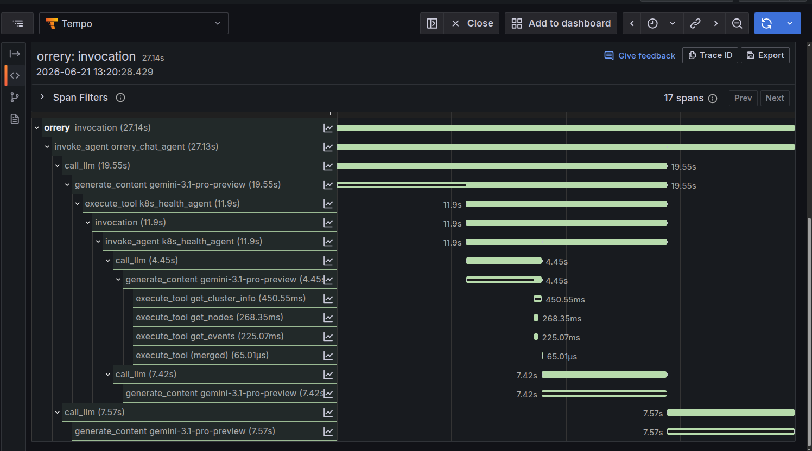

# Observability

Orrery ships three correlated signals, all wired globally through `default_plugins()` — no per-agent setup:

| Signal | What it answers | Backend |
|--------|-----------------|---------|
| **Metrics** | *How much? How often?* — call rates, latency, errors, tokens | Prometheus (`/metrics`) |
| **Traces** | *Where* did a single request spend its time? | OpenTelemetry → Tempo / Jaeger |
| **Logs** | *What happened*, line by line, correlated to a trace | Structured JSON → Loki / Cloud Logging |

Metrics are on by default; tracing is an opt-in extra. The two share a Grafana stack you can bring up with `make up PROFILES=tracing`.

---

## Metrics

The platform exposes Prometheus metrics for every tool call across all agents — real-time visibility into tool latency, error rates, agent usage, and circuit-breaker state.

### Quick start

Metrics are enabled automatically via `default_plugins()` — no per-agent wiring needed:

```python
from orrery_core import MetricsPlugin, default_plugins
from google.adk.runners import Runner

plugins = default_plugins()
runner = Runner(
    agent=root_agent,
    app_name="my_agent",
    session_service=session_service,
    plugins=plugins,
)

# Expose /metrics on port 9100 (call once at startup).
# The Slack and Google Chat bots do this in their FastAPI lifespan.
metrics_plugin = next(p for p in plugins if isinstance(p, MetricsPlugin))
metrics_plugin.start_server()
```

!!! note "`default_plugins()` does not auto-start the metrics server"
    The `MetricsPlugin` is registered, but the `/metrics` HTTP server is only started when a host calls `start_server()` explicitly. This is intentional — the ADK CLI and tests don't want a port binding. The Slack bot (`agents/slack-bot/slack_bot/app.py`) and Google Chat bot start it in their FastAPI `lifespan`; the persistent runner starts it when `ENABLE_METRICS_SERVER=true`.

### Available metrics

All metrics use the `orrery_` namespace prefix following [Prometheus naming conventions](https://prometheus.io/docs/practices/naming/).

| Metric | Type | Labels | Description |
|--------|------|--------|-------------|
| `orrery_tool_calls_total` | Counter | `agent`, `tool`, `status` | Total tool invocations with bounded status values |
| `orrery_tool_duration_seconds` | Histogram | `agent`, `tool` | Tool execution latency (buckets: 50ms to 60s) |
| `orrery_tool_errors_total` | Counter | `agent`, `tool`, `error_type` | Errors broken down by exception type |
| `orrery_circuit_breaker_state` | Gauge | `tool` | Circuit breaker state: 0=closed, 1=open, 2=half_open |
| `orrery_llm_tokens_total` | Counter | `agent`, `direction` | LLM token consumption (input/output) |
| `orrery_context_cache_events_total` | Counter | `event` | Context cache hits and misses |
| `orrery_context_compaction_total` | Counter | — | Conversation histories compacted into a summary |
| `orrery_safety_screen_total` | Counter | `direction`, `source` | Prompt-injection screening engagements |
| `orrery_confirmations_raised_total` | Counter | `tool`, `mode` | Guarded calls paused for human approval |
| `orrery_confirmations_decided_total` | Counter | `tool`, `decision` | Decisions the gate accepted |
| `orrery_confirmations_refused_total` | Counter | `tool`, `reason` | Decisions the gate rejected |
| `orrery_confirmations_expired_total` | Counter | — | Pendings that aged out unanswered |
| `orrery_confirmation_decision_seconds` | Histogram | `tool` | How long humans take to decide |

The `status` label on `orrery_tool_calls_total` is restricted to a fixed set — `ok`, `success`, `error`, `confirmation_required` — to prevent [cardinality explosion](https://prometheus.io/docs/practices/naming/#labels); any other value is normalised to `ok`.

Watch `orrery_context_compaction_total` against the cache counter: each compaction rewrites the history and so invalidates the cached prefix. A rising compaction rate alongside a falling cache-hit rate means `ORRERY_COMPACTION_TOKEN_THRESHOLD` is set too low.

`orrery_safety_screen_total` counts the injection screen *engaging*, which is the control working rather than a breach — a direct hit was refused before it cost a token, an indirect one had only the matched span replaced. The `direction` label separates two findings that must not be summed: `direct` (`source="user_message"`) means someone is probing the agent, while `indirect` (`source=<tool>`) means attacker-reachable text is sitting in the monitored infrastructure, which is a finding about *that* system. Indirect hits count **spans**, not events: two injected lines in one payload is a worse finding than one.

The confirmation counters (AEP-024) record a gate that was already correct but silent. `orrery_confirmations_refused_total{reason="not_requester"}` is the one to alert on: someone other than the requester attempting to approve a guarded action is either a confused operator or an attempt to escalate, and before these counters existed it left no trace anywhere. `reason` is a bounded enum — `not_requester`, `unknown_requester`, `stale_decision`, `no_pending` — so it aggregates. The `mode` label on the raise counter distinguishes `requester_verified` from `scoped` transports, which is what lets an auditor tell a human-approved production change from a model re-call on a dev surface.

### How it works

`MetricsPlugin` wraps `MetricsCollector` and registers as a global plugin on the `Runner`, implementing three callbacks:

- **`before_tool_callback`** — generates a unique invocation ID and starts a timer
- **`after_tool_callback`** — records duration and success/error status
- **`on_tool_error_callback`** — records error type, duration, and increments error counters

Since plugins apply globally, metrics are collected for every tool across every agent automatically. `default_plugins()` also wires the `ResiliencePlugin`'s circuit breaker into `MetricsPlugin`, so `orrery_circuit_breaker_state` tracks state changes per tool. For LLM tokens, call `track_llm_tokens("my_agent", input_tokens=150, output_tokens=300)` from a model callback — when tracing is enabled, `TracingPlugin` does this for you (see [below](#distributed-tracing)).

### Configuration & scraping

| Environment Variable | Default | Description |
|---------------------|---------|-------------|
| `METRICS_PORT` | `9100` | TCP port for the `/metrics` HTTP server |

`infra/prometheus.yml` includes a pre-configured scrape job. For **local development** (agent on host, Prometheus in Docker) it targets `host.docker.internal:9100`; for an in-cluster **Docker deployment**, point it at the service names (`orrery-assistant:9100`, `slack-bot:9100`). The compose Prometheus service sets `extra_hosts: ["host.docker.internal:host-gateway"]` so the local config works on Linux.

### Example PromQL

```promql
rate(orrery_tool_errors_total[5m])                                   # tool error rate (5m)
histogram_quantile(0.95, rate(orrery_tool_duration_seconds_bucket[5m]))  # p95 latency
rate(orrery_tool_calls_total[1m]) * 60                               # calls/min by tool
orrery_circuit_breaker_state == 1                                    # breakers currently open
increase(orrery_llm_tokens_total[1h])                                # tokens/agent, last hour
sum by (source) (increase(orrery_safety_screen_total{direction="indirect"}[15m]))  # injected text by tool
increase(orrery_confirmations_refused_total{reason="not_requester"}[1h])  # unauthorized approvals
```

---

## Distributed Tracing

Metrics tell you *how much* and *how often*; traces tell you *where* a single request spent its time. ADK 2.0 already emits native spans for every agent, tool, and LLM call — orrery configures the exporter and **enriches** those spans rather than creating duplicates.



*A real `orrery` turn in Grafana Tempo: the 27s invocation fans out through `orrery_chat_agent` → `call_llm` → the `k8s_health_agent` AgentTool → its own `call_llm` and `execute_tool` spans (`get_cluster_info`, `get_nodes`, `get_events`). The span widths make the latency hotspot obvious at a glance.*

### Enable it

Install the extra and flip one env var:

```bash
uv sync --extra otel
export OTEL_TRACING_ENABLED=true
export OTEL_EXPORTER_OTLP_ENDPOINT=http://localhost:4317   # omit to print spans to the console
```

`default_plugins()` reads `OTEL_TRACING_ENABLED` and prepends `TracingPlugin` automatically, so every transport (Google Chat, Slack, the HTTP server, the persistent runner) picks it up — no per-agent wiring. A missing `[otel]` extra is a skip-with-warning, not a crash. The full env-var table lives in [Configuration → Distributed Tracing](config/general.md#distributed-tracing).

### What the spans carry

`TracingPlugin` annotates the active span (never a duplicate) with:

- `orrery.request_id`, `orrery.user_role`
- `orrery.tool.name`, `orrery.tool.status`, `orrery.tool.result_size`
- exceptions recorded with `ERROR` status on tool/model failures

LLM token counts ride on ADK's native `gen_ai.usage.*` attributes; `TracingPlugin` bridges them into the `orrery_llm_tokens_total` metric so traces and metrics always agree.

### Log ↔ trace correlation

Every JSON log line emitted while handling a request carries `request_id`, plus `trace_id` / `span_id` when a span is active — so you can pivot from a log line straight to the matching trace in Tempo/Jaeger. `request_id` works even without the `otel` extra installed.

### Local stack: Tempo + Grafana

`make up PROFILES=tracing` starts Tempo (OTLP ingest + storage) and Grafana under the `tracing` compose profile:

```bash
make up PROFILES=tracing                                      # Tempo :4317/:3200, Grafana :3001
OTEL_TRACING_ENABLED=true \
OTEL_EXPORTER_OTLP_ENDPOINT=http://localhost:4317 \
make run-dev                                   # spans flow to Tempo
make down
```

Open Grafana at [http://localhost:3001](http://localhost:3001) (anonymous admin). It ships with two provisioned artifacts:

- **Datasources** — Tempo (traces) and Prometheus (metrics), with the trace→metrics link pre-wired so you can pivot from a span to the `orrery_*` metrics for its service.
- **Dashboard** — *Orrery — Agent Observability* (in the **Orrery** folder): tool call rate, p95 latency, error rate by type, LLM tokens/s, circuit-breaker state, and a live table of recent `service.name = orrery` traces. Click any Trace ID to open the full span tree — slow turns are usually dominated by a single large `call_llm` span, which is the cue to trim what a tool feeds back to the model.

---

## Where it runs

All agents get metrics (and tracing, when enabled) automatically through `default_plugins()` on the `Runner` — no per-agent setup.

| Deployment | Metrics server | Tracing |
|------------|----------------|---------|
| CLI / persistent runner | `metrics_plugin.start_server()` | `OTEL_TRACING_ENABLED=true` |
| Slack / Google Chat bot | Started in FastAPI lifespan on `:9100` | env-driven, per transport |
| Docker demo | Exposed on `:9100`, scraped by Prometheus | point OTLP at Tempo |
